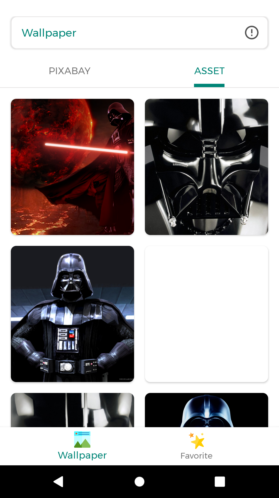

## wallpaper-consume-pixabay
Using Library https://github.com/amirisback/consumable-code-pixabay-api for fetching API, EASY TO RESKIN and Simple to Upload
- v2.0.0 - Development
- Stable Version
- Wallpaper from https://pixabay.com/id

## Screen Shoot

| UI 1 | UI 2 | UI 3 |
|:----:|:----:|:----:|
| |  |  |

## Version Release
This Is Latest Release

    $version_release = 2.0.0

What's New??

    * Easy To Reskin *

## How To Use This Project
<h3>Step 1. Open app/build.gradle</h3>

App Name

	// Declaration app name
    def nameApp = "[Your App Name]"
    
Topic Name
        
    // Declaration Topic Name
    def topicWallpaper = '"One Piece"'
    
Package Name

    defaultConfig {
        ....
        applicationId "com.[your playstore account].[your project]"
        ....

Key Store
        
    signingConfigs {
            release {
                // You need to specify either an absolute path or include the
                // keystore file in the same directory as the build.gradle file.
                // [PROJECT FOLDER NAME/app/[COPY YOUT KEY STORE] .jks in here
                storeFile file("frogoboxdev.jks")
                storePassword "cronoclez"
                keyAlias "frogobox"
                keyPassword "xeonranger"
            }
        }
    
Admob ID 

    release {
        ....
        // Declaration admob id for release
        def releaseAdmobPublisherId = ""
        def releaseAdmobBanner = ""
        def releaseAdmobInterstitial = ""
        def releaseAdmobInterstitialVideo = ""
        def releaseAdmobRewardedVideo = ""
        def releaseAdmobNativeAdvanced = ""
        def releaseAdmobNativeAdvancedVideo = ""
        ....
        }
    
<h3>Step 2. Change Icon</h3>

    Change Launcher Icon on app/src/res/drawable/ic_launcher

	
<h3>Step 3. Replace JKS</h3>

    // You need to specify either an absolute path or include the
    // keystore file in the same directory as the build.gradle file.
    // [PROJECT FOLDER NAME/app/[COPY YOUT KEY STORE] .jks in here
	

## Colaborator
Very open to anyone, I'll write your name under this, please contribute by sending an email to me

- Mail To faisalamircs@gmail.com
- Subject : Github _ [Github-Username-Account] _ [Language] _ [Repository-Name]
- Example : Github_amirisback_kotlin_admob-helper-implementation

Name Of Contribute
- Muhammad Faisal Amir
- Waiting List
- Waiting List

Waiting for your contribute

## Attention !!!
Please enjoy and don't forget fork and give a star
- Don't Forget Follow My Github Account
- If you like this library, please help me / you can donate to buy patreon services
